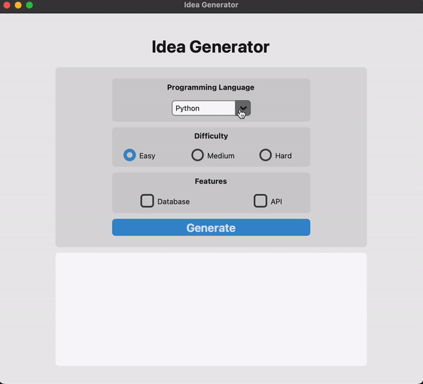

# Idea Generator

- Idea Generator is a Python application that uses the OpenAI GPT-3.5-turbo model to generate project ideas based on user inputs such as programming language, difficulty, and additional features. It leverages the customtkinter package to create a user-friendly graphical interface.

## Features
- Allows users to choose a programming language
- Provides three difficulty levels: Easy, Medium, and Hard
- Optional features: Database, API
- Generates project ideas using the GPT-3.5-turbo model from OpenAI

## Installation
- To install the required packages, run:

- pip install openai customtkinter

## Usage
Set the OPENAI_API_KEY environment variable with your OpenAI API key:

1. export OPENAI_API_KEY=your_api_key
2. Run the idea_generator.py script:
python idea_generator.py
3. Use the graphical interface to select your desired programming language, difficulty, and additional features. Click the "Generate" button to generate a project idea.

## Dependencies
- Python 3.7+
- openai package for API calls to OpenAI
- customtkinter package for the graphical interface

## Contributing
Pull requests are welcome. For major changes, please open an issue first to discuss what you would like to change.

